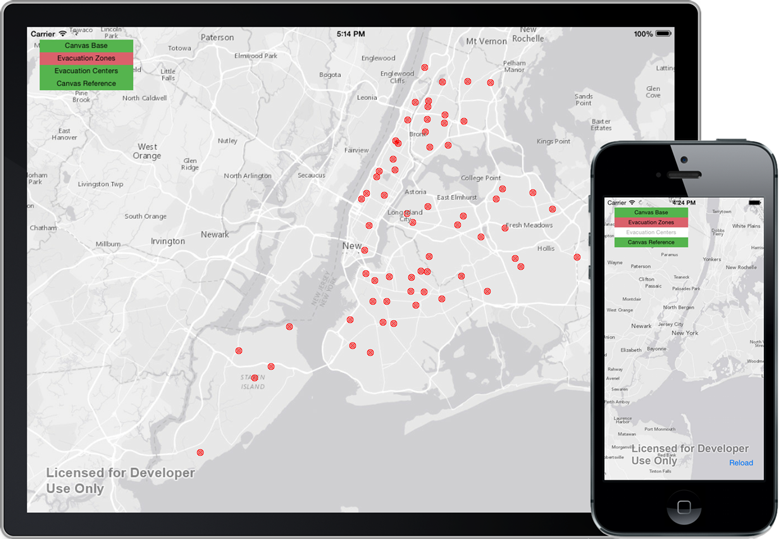

layerloading-plugin-ios
===

A sample framework to add notifications to show when layers in an [`AGSMapView`](https://developers.arcgis.com/ios/api-reference/interface_a_g_s_map_view.html) are loading.

AGSMapView is a component of Esri's [ArcGIS Runtime SDK for iOS](http://resources.arcgis.com/en/help/runtime-ios-sdk/concepts/#//00pw00000003000000).

## Features
* Provides notifications from each `AGSLayer` when it starts/stops loading.
* Automatically start tracking the loading state of layers as they're added to an `AGSMapView`.
* Disable automatic tracking and allow tracking layers manually (with notifications as tracking starts/stops).

## Getting Started
Just add the `.m` and `.h` files for the `AGSLayer+NXTLayerLoading` and `AGSMapView+NXTLayerLoading` categories to your project. You don't need to initialize anything. As long as the `.m` files are built as part of your target, the framework is hooked in.

If you want to control layer tracking manually rather than automatically, either skip the `AGSMapView` category or use its property to disable automatic tracking.

The `AGSLayer+NXTLayerLoading.h` file defines 4 notifications (whose `object` property is the `AGSLayer` in question):

### Load events:
* Layer starts loading: `kNXTLLNotification_LayerLoading`
* Layer finished loading: `kNXTLLNotification_LayerLoaded`

### Framework events:
* Layer starts being monitored: `kNXTLLNotification_LayerTrackingStartedForLayer`
* Layer stops being monitored: `kNXTLLNotification_LayerTrackingStoppedForLayer`

See the `SampleViewController.m` file for examples of how to use the layer tracking.

## Requirements

* Xcode and the iOS SDK (download [here](https://developer.apple.com/xcode/downloads/))
* ArcGIS Runtime SDK for iOS 10.1.1 or later (download [here](http://www.esri.com/apps/products/download/index.cfm?fuseaction=download.all#ArcGIS_Runtime_SDK_for_iOS))

## Resources

* [ArcGIS Runtime SDK for iOS Resource Center](http://resources.arcgis.com/en/help/runtime-ios-sdk/concepts/#//00pw00000003000000)
* [ArcGIS Runtime SDK Forums](http://forums.arcgis.com/forums/78-ArcGIS-Runtime-SDK-for-iOS)
* [ArcGIS Blog](http://blogs.esri.com/esri/arcgis/)
* Twitter [@esri](http://twitter.com/esri)
* [Apple iOS Dev Center](https://developer.apple.com/devcenter/ios/index.action)

## Issues

Find a bug or want to request a new feature?  Please let me know by submitting an Issue.

## Contributing

Anyone and everyone is welcome to contribute. 

## Licensing
Copyright 2012 Nick Furness

Licensed under the Apache License, Version 2.0 (the "License");
you may not use this file except in compliance with the License.
You may obtain a copy of the License at

   http://www.apache.org/licenses/LICENSE-2.0

Unless required by applicable law or agreed to in writing, software
distributed under the License is distributed on an "AS IS" BASIS,
WITHOUT WARRANTIES OR CONDITIONS OF ANY KIND, either express or implied.
See the License for the specific language governing permissions and
limitations under the License.

A copy of the license is available in the repository's [license.txt](https://raw.github.com/nixta/arcgis-layerloading-ios/master/license.txt) file.
